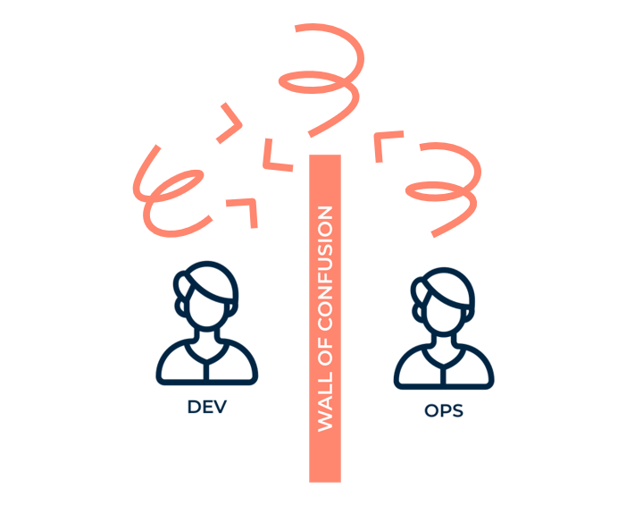

# DevOps: Hvorfor og hvordan?

---

## 1. Introduktion til DevOps

**Hvad er DevOps?**

- Målet: **Bryde siloer** og skabe en **glidende strøm** af værdi til kunden.
- Fokus på **samarbejde** mellem udvikling (Dev) og drift (Ops) for at levere software **hurtigere, mere sikkert og pålideligt**.
- **Ikke** kun værktøjer eller processer – det er en **kultur** og et **mindset**.

**Hvorfor er det vigtigt?**

- Traditionelle IT-metoder skaber **langsomme leverancer**, **ustabile systemer** og **utilfredse medarbejdere**.
- DevOps hjælper med at **øge hastigheden**, **forbedre kvaliteten** og **skabe bedre arbejdsmiljøer**.

---

## 2. De tre grundprincipper i DevOps
---

### A. The First Way: **Flow**

**Mål:** Skab en **glidende og hurtig strøm** af arbejde fra idé til produktion.

**Hvordan?**

- **Gør arbejdet synligt** (f.eks. med Kanban-boards).
- **Begræns "Work in Progress" (WIP)** – for mange opgaver på én gang skaber flaskehalse.
- **Reducer batch-størrelser** – små, hyppige ændringer er bedre end store, sjældne.
- **Minimer overleveringer** – automatiser og integrer teams for færre "håndovers".
- **Fjern flaskehalse** – løs de største hindringer i processen.

**Eksempel:**

- Traditionel IT: Store releases hver 6. måned → kaos og fejl.
- DevOps: Små releases flere gange om dagen → mindre risiko, hurtigere feedback.

---

### B. The Second Way: **Feedback**

**Mål:** **Forstærk og accelerer feedback** fra drift til udvikling.

**Hvordan?**

- **Overvågning og telemetri** – saml data fra produktion (logs, metrics, alerts).
- **Hurtig detektion og genopretning** – fejl skal opdages og fixes med det samme.
- **Sikkerhed integreres tidligt** – ikke som et "afterthought".
- **Blameless post-mortems** – lær af fejl uden at bebrejde.

**Eksempel:**

- Hvis en fejl opdages, får udviklerne besked **med det samme** (f.eks. via Slack).
    * https://github.com/marketplace?query=slack+notify
---

### C. The Third Way: **Continual Learning**

**Mål:** Skab en **kultur for eksperimentering og læring**.

**Hvordan?**

- **Tillid og psykologisk tryghed** – turde sige "det gik galt" uden frygt.
- **Lær af fejl** – udfør "post-mortems" og del lærdomme på tværs af teams.
- **Automatiser rutineopgaver** – så folk kan bruge tid på at lære.
- **Reserver tid til forbedringer** – f.eks. 20% tid til at optimere processer.

---

## 3. Hvorfor DevOps?

**Problemet:**

- Siloer mellem Dev, Ops og Security → **langsomme leverancer**, **ustabile systemer**, **stressede medarbejdere**.

**Fordelene ved DevOps:**

| Metrik                     | Traditionel IT    | DevOps (High Performers) |
| -------------------------- | ----------------- | ------------------------ |
| **Deployment frekvens**    | 1-2 gange om året | Flere gange om dagen     |
| **Lead time for changes**  | Måneder           | Timer/minutter           |
| **Mean Time to Recovery**  | Dage/uger         | Minutter/timer           |
| **Change Failure Rate**    | 30-50%            | < 10%                    |
| **Medarbejdertilfredshed** | Lav               | Høj                      |

*(Kilde: State of DevOps Report, Puppet Labs)*

**Cases:**

- **Etsy**: **50+ deployments om dagen**.
- **Amazon**: **130.000 deployments om dagen** (2015).

---

## 4. Hvad holder os tilbage?

**Typiske udfordringer:**

1. **Kultur**: "Det har vi altid gjort sådan".
2. **Siloer**: Teams arbejder ikke sammen.
3. **Manglende automatisering**: Manuelle processer → fejl og langsomhed.
4. **Frygt for fejl**: Ingen risikovillighed.
5. **Teknisk gæld**: Gamle systemer, der er svære at ændre.

**Løsninger:**

- Start småt: Vælg **ét team/ét projekt**.
- Fokuser på **kultur** før værktøjer.
- Automatiser **alt**, der kan automatiseres.
- Lær af andre: Læs *The DevOps Handbook*.

---

## 5. Gruppeøvelse: "How DevOps Are You?"

**Formål:**

- Reflektere over, **hvor DevOps I var i Hack-a-ton projektet**.
- Identificere **hindringer** for at blive "fully DevOps".
- Diskutere **konkrete forbedringer**.

**Sådan gør I:**

1. **I jeres grupper**.
2. **Lav to lister**:
  - **"Vi er DevOps fordi..."**: Hvor følger I allerede DevOps-principperne?
  - **"Vi er ikke fuldt DevOps fordi..."**: Hvilke hindringer er der?
3. **Reflekter over "hvorfor"**: Er hindringerne tekniske, kulturelle eller organisatoriske?
4. **Præsenter for klassen** (5 min pr. gruppe).

**Gør det samme for jeres CookBook projekt. Det er det i skal bruge til eksamenen.** 

**Spørgsmål til refleksion:**

- Hvordan håndterer I fejl? Bliver der lært af dem?
- Hvor lang tid tager det at deploye en ændring?
- Er jeres teams **cross-functional** (Dev + Ops + Test i samme team)?
- Bruger I **automatiserede tests** og **CI/CD**?
- Er der **psykologisk tryghed** til at eksperimentere?

---

## 6. Afslutning

- DevOps er en **rejse**, ikke et mål.
- **Start småt**, men **tænk stort**.
- **Kultur er nøglen** – værktøjer hjælper, men uden samarbejde virker de ikke.
- **Lær af fejl** – de er en chance for at blive bedre.

**Spørgsmål til diskussion:**

- Hvilke DevOps-principper vil være **sværest at implementere**? Hvorfor?
- Hvordan kan I **måle succes** med DevOps?
